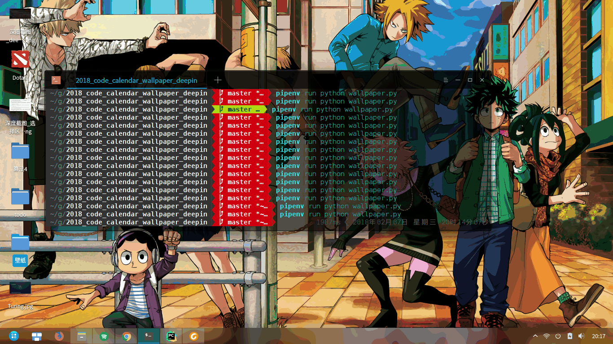

# 2018_code_calendar_wallper_deepin

直接修改的[RayZhao1998][1]的壁纸切换方式 因为分辨率的问题合适的大小需要自己手动调所以这个项目并不是很实用。
### 效果图


### 在deepin上的演示

依赖
* python3.6
* Wind

### 如何安装Wind
```
$ sudo apt-get install libmagickwand-dev
$ pip install Wind
```

### TODOLIST

-  修改项目结构
-  添加命令行参数输入

### 参考
1. [2018_code_calendar_wallper_macos][1]
2. [deepin如何在终端切换壁纸][2]
3. [Wind 文档][3]

[1]: https://github.com/RayZhao1998/2018_code_calendar_wallpaper_MacOS
[2]: https://bbs.deepin.org/forum.php?mod=viewthread&tid=29808
[3]: http://docs.wand-py.org/en/0.4.4/wand/sequence.html